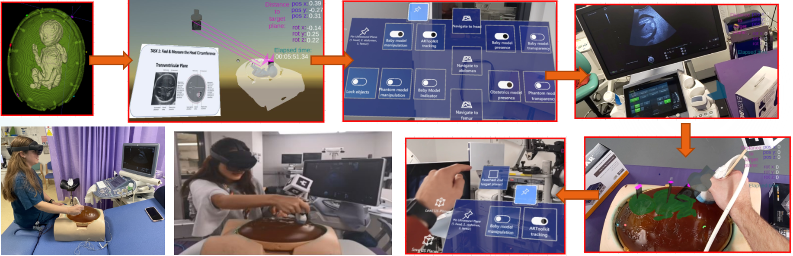

# CAL-Tutor

## Research article
| Our MDPI Journal of Imaging paper can be found here: |
|--------|
|[CAL-Tutor: A HoloLens 2 Application for Training in Obstetric Sonography and User Motion Data Recording](https://www.mdpi.com/2313-433X/9/1/6)|

##  Project description: 

The CAL-Tutor project is a Unity game engine application designed for the Microsoft HoloLens 2 that can be used in the context of medical education aplied to obstetrics ultrasound. 

The application uses the Mixed Reality Toolkit (MRTK) (https://github.com/microsoft/MixedRealityToolkit-Unity) in order to create mixed reality objects and user interactions. 

The provided holographic models are: 
- Baby incl. mother's abdomen (based on a 3D reconstruction of a phantom that is being used for medical education) 
- Clarius wireless ultrasound probe (https://clarius.com/)
- A holographic menu with several options

The application workflow consists of the following steps: 

1.) Manual alignment of the baby model to the physical phantom
2.) Navigation of the tracked ultrasound probe to 3 pre-defined standard ultrasound planes (placed at respective anatomical locations of the baby model)

The Clarius ultrasound probe is being tracked using QR codes that have to be printed and attached to the physical probe. 
The used tracking software is HoloLensArToolkit (https://github.com/qian256/HoloLensARToolKit).

During the navigation to the standard planes, holographic instruction cards can be displayed that describe the characteristics of the target anatomy. 

During the navigation phase user motion data is being recorded that can be downloaded via the HoloLens device portal.

## Demo video:
Click on the image below to see our CAL-Tutor demo video on youtube:

